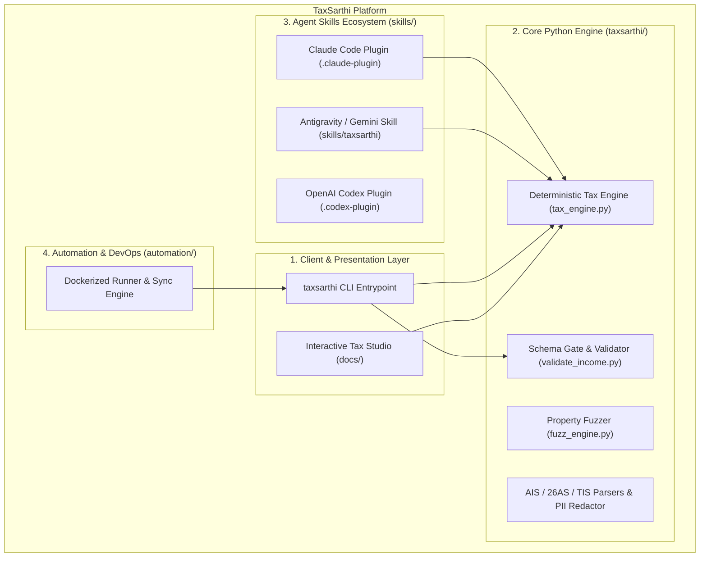

# TaxSarthi

<p align="center">
  
</p>

<p align="center">
  <strong>Intelligent, Deterministic Indian Income Tax (ITR) Engine & AI Co-Pilot</strong><br>
  <em>Assessment Year 2026-27 (Financial Year 2025-26)</em>
</p>

<p align="center">
  <a href="https://github.com/karanb192/itr-wala/actions/workflows/tests.yml"></a>
  <a href="https://opensource.org/licenses/MIT"></a>
  <a href="https://karanb192.github.io/itr-wala/"></a>
  <a href="#test-receipts--invariants"></a>
  <a href="#test-receipts--invariants"></a>
</p>

---

## 📌 Product Overview

**TaxSarthi** is an open-source, deterministic Indian income tax calculation engine and AI co-pilot designed for individual taxpayers filing for **AY 2026-27**. 

Unlike generic generative AI tax demos where an LLM performs approximate arithmetic, TaxSarthi establishes an unyielding division of responsibilities:
1. **The AI Assistant** transcribes structured and unstructured documents (Form 16, AIS JSON, Form 26AS, broker Capital Gains P&L) into a validated schema and conducts a proactive deductions interview.
2. **The Deterministic Python Engine** calculates every rupee of slab tax, Section 87A rebate & marginal relief, surcharge caps, 4% health & education cess, and sections 234A/B/C/F interest and fees.
3. **The User** retains full sovereign control to **Pay, Submit, and e-Verify** on the official Income Tax portal.

---

## ✨ Key Features

- **⚡ Live Old vs. New Regime Comparison**: Instantaneous side-by-side computation illustrating exact rupee savings between the default New Regime (u/s 115BAC) and the Old Regime.
- **🛡️ 3-Layer Mathematical Rigor**:
  - **51 Golden Tests** hand-derived directly from statutory provisions.
  - **104 Validator Tests** guarding against misspelled schema keys, malformed data, and negative amounts.
  - **Seeded Property-Based Invariant Fuzzer** asserting statutory invariants over 350,000+ randomized returns.
- **🔒 Privacy-Preserving & Zero-Trust**:
  - Automated blind extraction scripts for encrypted AIS JSON and Form 26AS.
  - Rejects inputs containing PAN, Aadhaar, or bank credentials.
  - Never prompts for or stores portal passwords or OTPs.
- **🌐 Interactive Web Application & Tax Studio**: A client-side, responsive tax computation simulator and schedule navigator.
- **🔌 Multi-Agent Integration**: First-class support as a native skill/plugin for **Antigravity / Gemini**, **Claude Code**, and **OpenAI Codex**, plus a standalone Python CLI.
- **🐳 Docker Automation Environment**: Fully isolated containerization for automated validation and GitHub synchronization.

---

## 🏗️ Architecture Overview



---

## 🚀 Quick Start

### 1. Web Tax Studio
Open the live interactive tax studio locally:
```bash
# Open docs/index.html in your browser
open docs/index.html
```

### 2. Universal Agent Installer
Clone the repository, review the code, and install directly into your AI assistant:
```bash
git clone https://github.com/karanb192/itr-wala.git
cd itr-wala

# Install for Claude Code
./install.sh

# Install for Gemini / Antigravity
./install.sh gemini

# Install for OpenAI Codex
./install.sh codex

# Install for all platforms
./install.sh all
```

### 3. Python CLI Installation
```bash
pip install -e .

# Run CLI commands
taxsarthi --help
taxsarthi compute skills/taxsarthi/assets/example-income.json
taxsarthi validate skills/taxsarthi/assets/example-income.json
taxsarthi selftest
```

---

## 📊 Sample Output

Running `taxsarthi compute skills/taxsarthi/assets/example-income.json`:

```text
Income-tax computation for FY 2025-26 (AY 2026-27)
================================================================

[NEW REGIME]
  Gross total income               26,06,700
  Deductions                        1,00,000
  Total income                     25,06,700
  Tax on slab income                2,75,425
  111A STCG (equity)                   9,000
  112A LTCG (equity)                   4,375
  Cess (4%)                           11,552
  TOTAL TAX                         3,00,350
  Interest/fee 234C                     366
  NET PAYABLE (-ve=refund)               720

[OLD REGIME]
  Gross total income               22,09,300
  Deductions                        3,35,000
  Total income                     18,74,300
  Tax on slab income                3,13,290
  111A STCG (equity)                   9,000
  112A LTCG (equity)                   4,375
  Cess (4%)                           13,067
  TOTAL TAX                         3,39,730
  Interest/fee 234B                   1,588
  Interest/fee 234C                   2,209
  NET PAYABLE (-ve=refund)            43,530

================================================================
  RECOMMENDED: NEW regime (saves Rs. 42,811)
  New: 3,00,716   Old: 3,43,527
```

---

## 🐳 Docker Automation Environment

TaxSarthi provides a dedicated, security-audited container automation suite in `automation/`:

```
automation/
├── Dockerfile
├── docker-compose.yml
├── .env.example
├── .gitignore
├── scripts/
│   ├── run_automation.sh
│   └── sync_repo.py
└── workspace/
```

### Running with Docker Compose:
1. Copy `.env.example` to `.env`:
   ```bash
   cp automation/.env.example automation/.env
   ```
2. Configure your environment variables (`TARGET_REPO`, `GITHUB_TOKEN`, `DRY_RUN=true`).
3. Run container automation:
   ```bash
   cd automation
   docker compose run taxsarthi-automation sync
   ```

---

## 🧪 Test Receipts & Invariants

Run the full verification suite locally:
```bash
# 1. Golden Tests
python3 skills/taxsarthi/scripts/test_tax_engine.py

# 2. Input Validator Tests
python3 skills/taxsarthi/scripts/test_validate_income.py

# 3. Document Extraction Tests
python3 skills/taxsarthi/scripts/test_extraction.py

# 4. Property-Based Seeded Invariant Fuzzer (3,000 iterations)
python3 -m taxsarthi.cli.main fuzz --cases 3000 --seed 42
```

---

## ⚖️ License & Attribution

This project is licensed under the **MIT License**.

- Original mathematical engine foundation and repository structure copyright © 2026 **Karan Bansal** (`karanb192/itr-wala`).
- TaxSarthi platform enhancements, interactive web studio, CLI packaging, and Docker automation copyright © 2026 **TaxSarthi Contributors**.
- Reference material (portal schedules and AIS SFT-code classification) adapted from the MIT-licensed `file-itr` project (`shivprime94/file-itr`).

See [`LICENSE`](LICENSE) for complete details.

---

## ⚠️ Statutory Disclaimer

> **TaxSarthi is an open-source software tool, not a chartered accountant or registered tax return preparer, and does not provide formal legal or financial advice.** All computations are performed strictly in accordance with published Indian Income-tax Act provisions for AY 2026-27 (FY 2025-26). Final filing, payment, and e-verification remain solely the responsibility of the individual taxpayer.
