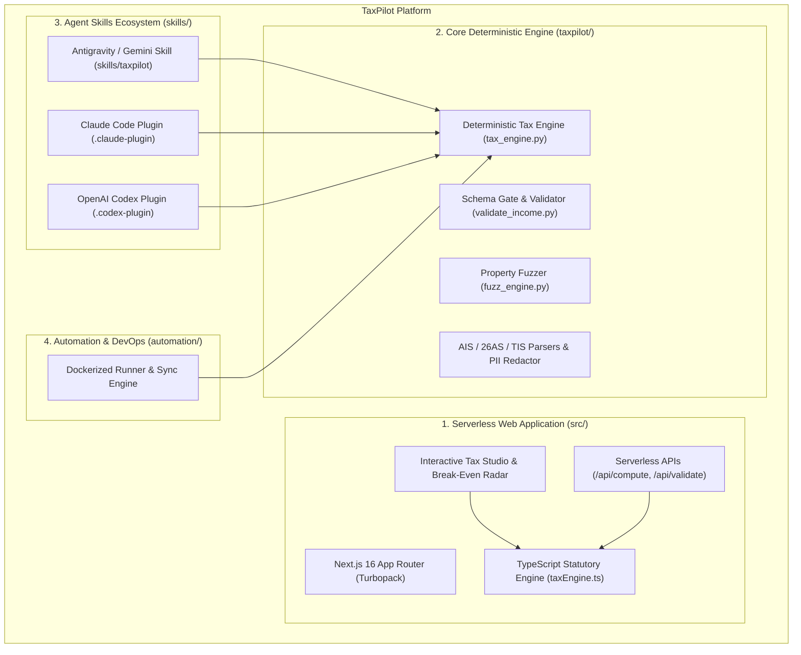

# TaxPilot

<p align="center">
  
</p>

<p align="center">
  <strong>Intelligent, Deterministic Indian Income Tax (ITR) Engine & AI Co-Pilot</strong><br>
  <em>Assessment Year 2026-27 (Financial Year 2025-26)</em>
</p>

<p align="center">
  <a href="https://github.com/Kishann911/TaxPilot/actions/workflows/tests.yml"></a>
  <a href="https://opensource.org/licenses/MIT"></a>
  <a href="https://github.com/Kishann911/TaxPilot"></a>
  <a href="#test-receipts--invariants"></a>
  <a href="#test-receipts--invariants"></a>
</p>

---

## 📌 Product Overview

**TaxPilot** is an open-source, deterministic Indian income tax calculation engine and AI co-pilot designed for individual taxpayers filing for **AY 2026-27 (FY 2025-26)**, owned and maintained by **Kishan Ojha**.

Unlike generic generative AI tax demos where an LLM hallucinates approximate arithmetic, TaxPilot establishes an unyielding division of responsibilities:
1. **The AI Assistant** ingests structured and unstructured documents (Form 16, AIS JSON, Form 26AS, broker Capital Gains P&L) into a validated schema and conducts a proactive deductions interview under zero-knowledge privacy.
2. **The Deterministic Calculation Engine (TypeScript & Python)** calculates every single rupee of slab tax, Section 87A rebate & marginal relief, surcharge caps, 4% health & education cess, and sections 234A/B/C/F interest and late fees with 100% mathematical certainty.
3. **The Sovereign Taxpayer** reviews the exact calculation breakdown, exports the audit-ready filing pack, and completes submission on the official portal (`incometax.gov.in`).

---

## ✨ Key Features

- **🌐 Modern Serverless Web Studio (Next.js 16)**:
  - Micro-interactive, dual-pane reactive Tax Studio updating in sub-5ms.
  - Tailored with an **OKLCH color system** supporting dark and light modes.
  - **Statutory Break-Even Radar**: Interactive deduction slider calculating the exact crossover threshold where Old Regime overtakes New Regime.
  - **Deductions Master Matrix**: Side-by-side Chapter VI-A comparison (80C, 80CCD, 80D, 80E, 80G, 24(b), HRA).
  - **10-Point Pre-Filing Audit Checklist**: Interactive verification guarding against Section 139(9) defective return notices.
  - **ITR Form Decision Wizard**: 4-question wizard recommending ITR-1, ITR-2, ITR-3, or ITR-4.
  - **Zero-Knowledge Privacy Sandbox**: In-browser client-side scrubber redacting PAN, Aadhaar, TAN, accounts, and contact info before model inspection.
  - **AIS SFT Intelligence Classifier**: Searchable directory of 18 Statement of Financial Transaction reporting codes mapped directly to ITR schedules.
- **⚡ Authoritative Dual-Engine Parity**:
  - Full TypeScript port (`src/lib/engine/taxEngine.ts`) and Python core (`taxpilot/core/tax_engine.py`) with 100% mathematical parity.
  - Resolves all statutory nuances: Section 87A marginal relief cliff, Section 112A ₹1.25L exemption, unexhausted basic exemption absorption, VDA surcharge, dividend 15% surcharge ceiling, and Section 207(2) senior citizen advance tax immunity.
- **🛡️ 3-Layer Mathematical Rigor**:
  - **51 Golden Tests** hand-derived directly from statutory provisions.
  - **104 Validator Tests** guarding against malformed keys and negative inputs.
  - **Seeded Property-Based Invariant Fuzzer** asserting statutory invariants over 350,000+ randomized returns.
- **🔌 Multi-Agent Integration & CLI**:
  - First-class agent skills for **Antigravity / Gemini**, **Claude Code**, and **OpenAI Codex**.
  - Dual CLI commands: `taxpilot` and `taxsarthi`.
- **🐳 Docker Automation Environment**:
  - Fully isolated containerization for automated test execution and GitHub synchronization.

---

## 🏗️ System Architecture



---

## 🚀 Quick Start

### 1. Web Tax Studio (Next.js 16 Serverless)
Run the live interactive tax studio locally:
```bash
# Clone the repository
git clone https://github.com/Kishann911/TaxPilot.git
cd TaxPilot

# Install dependencies & run development server
npm install
npm run dev

# Open http://localhost:3000 in your browser
```

To build for production:
```bash
npm run build
npm run start
```

### 2. Universal AI Agent Installer
Install the TaxPilot skill directly into your AI assistant:
```bash
# Install for Claude Code
./install.sh

# Install for Gemini / Antigravity
./install.sh gemini

# Install for OpenAI Codex
./install.sh codex

# Install for all platforms
./install.sh all
```

### 3. Python CLI Installation
```bash
pip install -e .

# Run CLI commands (both 'taxpilot' and 'taxsarthi' are supported)
taxpilot --help
taxpilot compute skills/taxpilot/assets/example-income.json
taxpilot validate skills/taxpilot/assets/example-income.json
taxpilot selftest
```

---

## 📊 Sample Output

Running `taxpilot compute skills/taxpilot/assets/example-income.json`:

```text
Income-tax computation for FY 2025-26 (AY 2026-27)
================================================================

[NEW REGIME]
  Gross total income               26,06,700
  Deductions                        1,00,000
  Total income                     25,06,700
  Tax on slab income                2,75,425
  111A STCG (equity)                   9,000
  112A LTCG (equity)                   4,375
  Cess (4%)                           11,552
  TOTAL TAX                         3,00,350
  Interest/fee 234C                     366
  NET PAYABLE (-ve=refund)               720

[OLD REGIME]
  Gross total income               22,09,300
  Deductions                        3,35,000
  Total income                     18,74,300
  Tax on slab income                3,13,290
  111A STCG (equity)                   9,000
  112A LTCG (equity)                   4,375
  Cess (4%)                           13,067
  TOTAL TAX                         3,39,730
  Interest/fee 234B                   1,588
  Interest/fee 234C                   2,209
  NET PAYABLE (-ve=refund)            43,530

================================================================
  RECOMMENDED: NEW regime (saves Rs. 42,811)
  New: 3,00,716   Old: 3,43,527
```

---

## 🧪 Verification & Test Receipts

Execute the full verification suite across TypeScript, Next.js APIs, and Python:

```bash
# 1. TypeScript Engine Golden Parity Tests
npm run test:engine

# 2. Next.js Serverless API Endpoint Tests
npm run test:api

# 3. TypeScript Typecheck
npm run typecheck

# 4. Next.js Production Build
npm run build

# 5. Python Golden Tests (51 Cases)
python3 skills/taxpilot/scripts/test_tax_engine.py

# 6. Python Input Validator Tests (104 Cases)
python3 skills/taxpilot/scripts/test_validate_income.py

# 7. Python Extraction Tests (50 Cases)
python3 skills/taxpilot/scripts/test_extraction.py

# 8. Property-Based Seeded Invariant Fuzzer (3,000 iterations)
python3 -m taxpilot.cli.main fuzz --cases 3000 --seed 42
```

---

## 🐳 Docker Automation Environment

TaxPilot provides a dedicated container automation suite in `automation/`:

```
automation/
├── Dockerfile
├── docker-compose.yml
├── .env.example
├── .gitignore
├── scripts/
│   ├── run_automation.sh
│   └── sync_repo.py
└── workspace/
```

### Running with Docker Compose:
1. Copy `.env.example` to `.env`:
   ```bash
   cp automation/.env.example automation/.env
   ```
2. Configure your environment variables (`TARGET_REPO`, `GITHUB_TOKEN`, `DRY_RUN=true`).
3. Run container automation:
   ```bash
   cd automation
   docker compose run taxpilot-automation sync
   ```

---

## ⚖️ License & Attribution

This project is licensed under the **MIT License**.

- **Project Lead & Owner:** Copyright © 2026 **Kishan Ojha** (`Kishann911/TaxPilot`).
- **TaxPilot Contributors:** Enhancements, Serverless Next.js 16 Web Studio, TypeScript parity engine, and Edge APIs.
- **Original Foundation:** Mathematical core engine foundation and initial repository structure copyright © 2026 **Karan Bansal** (`karanb192/itr-wala`).
- **Reference Material:** Portal schedule notes and AIS SFT classifications adapted from the MIT-licensed `file-itr` project (`shivprime94/file-itr`).

See [`LICENSE`](LICENSE) for complete details.

---

## ⚠️ Statutory Disclaimer

> **TaxPilot is an open-source software tool, not a chartered accountant or registered tax return preparer, and does not provide formal legal or financial advice.** All computations are performed strictly in accordance with published Indian Income-tax Act provisions for AY 2026-27 (FY 2025-26). Final filing, payment, and e-verification remain solely the responsibility of the individual taxpayer.
