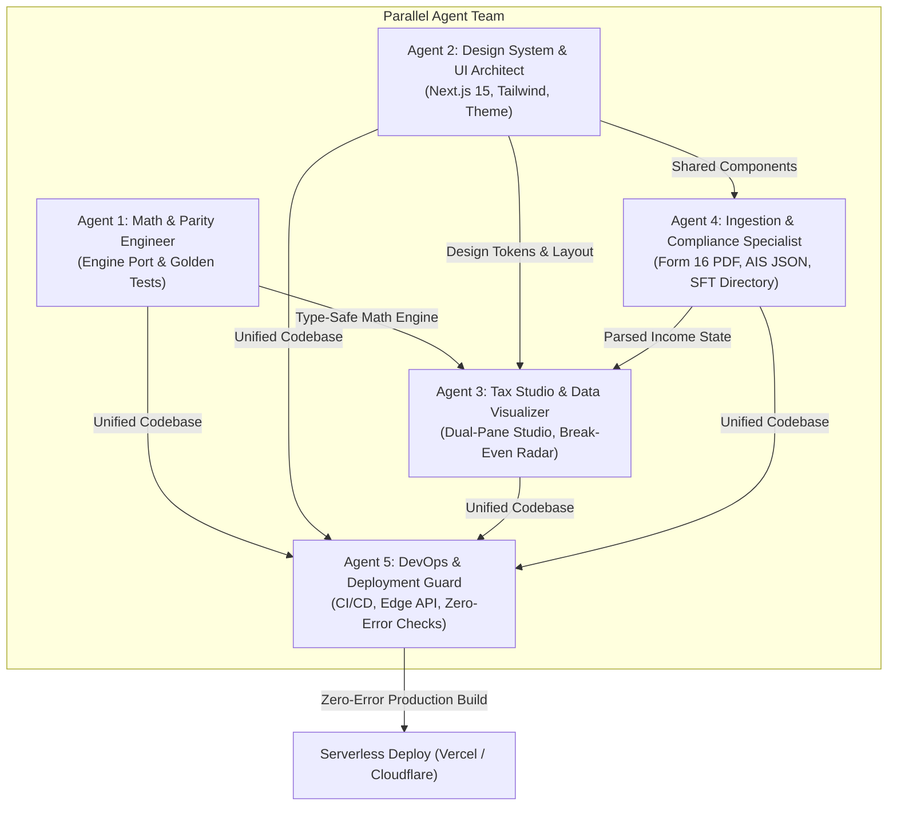

# 5. Fast-Track Implementation Plan & Deployment Guide

> **Multi-Agent Execution Strategy & Zero-Error Deployment Pipeline**  
> *Target: Production-Ready Serverless Next.js 16 Platform in 5 Sprints*  
> *Maintained & Owned by Kishan Ojha (`Kishann911/TaxPilot`)*

---

## 1. Fast-Track Multi-Agent Orchestration Model

To execute this transition rapidly without introducing regression bugs or delays, development is decomposed into five parallel agent roles:



---

## 2. 5-Day Fast-Track Sprint Schedule

| Sprint / Day | Focus Area | Deliverables & Verification Gates |
| :--- | :--- | :--- |
| **Day 1** | **Authoritative TypeScript Engine Port** | • Port `taxsarthi/core/tax_engine.py` to `lib/engine/taxEngine.ts`.<br>• Fix all 10 legacy JS discrepancies (234B rollover, 111A/112A basic exemption absorption, VDA surcharge, dividend capping).<br>• Set up Vitest test runner executing the **51 Golden Test fixtures** with 100% parity against Python. |
| **Day 2** | **Next.js 15 Scaffold & Design System** | • Initialize Next.js 15 App Router, React 19, TypeScript, and Tailwind CSS v4.<br>• Implement dark obsidian color tokens, glassmorphic card styles, and theme switcher.<br>• Build responsive layout shell: Navigation Header, Status Bar, and Terminal Hero section. |
| **Day 3** | **Interactive Tax Studio & Visual Analytics** | • Build dual-pane studio (`StudioInputs.tsx` and `RegimeLedger.tsx`).<br>• Connect reactive state machine for instant sub-5ms recalculation on every input change.<br>• Implement the **Regime Break-Even Radar** chart and dynamic Tax Waterfall.<br>• Build the interactive Slab Breakdown Table and Section 234 interest preview. |
| **Day 4** | **Document Dropzone, SFT & Audit Tools** | • Implement client-side `DocumentDropzone.tsx` for zero-knowledge Form 16 PDF & AIS JSON parsing.<br>• Build searchable AIS SFT Directory with instant category filtering.<br>• Build 10-point Pre-Filing Audit Checklist with live circular SVG progress ring.<br>• Build 4-question ITR Form Decision Wizard and CA-grade Master Tax Sheet export. |
| **Day 5** | **Serverless Edge APIs & Zero-Error Deployment** | • Implement Edge routes (`/api/compute`, `/api/validate`, `/api/redact`).<br>• Configure GitHub Actions workflow running Python tests, TypeScript tests, and `next build`.<br>• Deploy to Vercel or Cloudflare Pages with zero runtime errors. |

---

## 3. Zero-Error Deployment Safeguards

To ensure that deployments never fail or produce runtime errors:

### Safeguard 1: Strict TypeScript Compilation
- Enforce strict type checking in `tsconfig.json`:
  ```json
  {
    "compilerOptions": {
      "strict": true,
      "noImplicitAny": true,
      "strictNullChecks": true,
      "noUnusedLocals": true,
      "noUnusedParameters": true
    }
  }
  ```
- Build step executes `tsc --noEmit` before bundling. Any type mismatch halts deployment immediately.

### Safeguard 2: Automated Golden Parity Test Suite
- In CI, before `next build` runs, Vitest executes the exact same 51 test cases as `test_tax_engine.py`.
- If a single rupee deviates between the Python engine and the TypeScript engine, the build fails.

### Safeguard 3: Hydration Mismatch Elimination
- Browser-specific data (e.g. system theme preference, client dates, local storage caches) are resolved inside `useEffect` or with `suppressHydrationWarning` on the `<html>` root tag.
- Client-only visualizer components (Recharts / Canvas) are dynamically imported with `{ ssr: false }`.

### Safeguard 4: Zero Database & Zero Cloud Infrastructure Dependencies
- The application requires no database connections, no Redis caches, and no third-party API keys to boot.
- Eliminates connection pool timeouts, cold-start latency spikes, and external service downtime.

---

## 4. One-Click Deployment Configuration

### Option A: Vercel Deployment (Recommended for Edge APIs)
1. Push changes to GitHub repository `main` branch.
2. In Vercel, click **Import Project** and select the repository.
3. Configure Build Settings:
   - **Framework Preset:** Next.js
   - **Root Directory:** `./` (or `web/`)
   - **Build Command:** `npm run build`
   - **Output Directory:** `.next`
4. Deploy. Vercel automatically deploys edge functions across global regions.

### Option B: Cloudflare Pages or GitHub Pages (Pure Static Export)
In `next.config.ts`:
```typescript
import type { NextConfig } from 'next';

const nextConfig: NextConfig = {
  output: 'export',
  images: { unoptimized: true },
  basePath: process.env.NODE_ENV === 'production' ? '/TaxPilot' : '',
};

export default nextConfig;
```
Running `npm run build` generates a standalone static distribution in `out/` ready to upload to any static hosting service.

---

## 5. CI/CD GitHub Actions Workflow (`.github/workflows/deploy.yml`)

```yaml
name: TaxPilot Zero-Error CI/CD

on:
  push:
    branches: [ main ]
  pull_request:
    branches: [ main ]

jobs:
  python-verification:
    runs-on: ubuntu-latest
    steps:
      - uses: actions/checkout@v4
      - uses: actions/setup-python@v5
        with:
          python-version: "3.11"
      - run: pip install -e .
      - run: python3 skills/taxsarthi/scripts/test_tax_engine.py
      - run: python3 skills/taxsarthi/scripts/test_validate_income.py

  nextjs-verification:
    runs-on: ubuntu-latest
    steps:
      - uses: actions/checkout@v4
      - uses: actions/setup-node@v4
        with:
          node-version: 22
          cache: 'npm'
      - run: npm ci
      - run: npm run test:engine
      - run: npm run typecheck
      - run: npm run build
```
