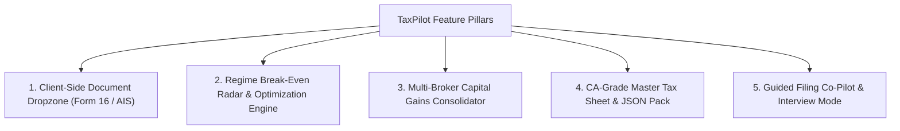

# 3. Feature Roadmap & High-Value Specifications

> **High-Impact Additions to Elevate TaxPilot to an Enterprise-Grade Tax Platform**  
> *Assessment Year 2026-27 (Financial Year 2025-26)*  
> *Maintained & Owned by Kishan Ojha (`Kishann911/TaxPilot`)*

---

## 1. Roadmap Overview & Strategic Priorities

To transform TaxPilot from a developer CLI tool and static calculator into the premier open-source Indian tax platform, five major feature pillars are introduced:



---

## 2. Pillar 1: Client-Side Document Dropzone (Zero-Knowledge Ingestion)

### Problem:
Taxpayers currently re-type 20+ numerical values from Form 16 Part B, bank interest certificates, and AIS statements into manual input fields. This introduces transcription errors and causes user drop-off.

### Solution:
A zero-knowledge client-side dropzone that parses PDF and JSON files **entirely inside browser memory** via Web Workers, with zero network requests.

```
+-----------------------------------------------------------------------+
|  📄 DRAG & DROP FORM 16 PDF OR AIS JSON                               |
|  [ Form 16 Part B PDF ]    [ AIS Annual Information Statement JSON ]  |
|                                                                       |
|  🔒 100% Client-Side Ingestion · Zero Server Upload · Auto-Redacted   |
+-----------------------------------------------------------------------+
```

### Technical Specification:
1. **Form 16 Part B PDF Parser:**
   - Uses `pdfjs-dist` inside an isolated Web Worker.
   - Employs coordinate-based spatial text pattern recognition to extract:
     - Gross Salary u/s 17(1)
     - Perquisites u/s 17(2)
     - Standard Deduction u/s 16(ia)
     - Professional Tax u/s 16(iii)
     - Chapter VI-A Deductions (80C, 80CCD(1B), 80CCD(2), 80D)
     - Total Tax Deducted at Source (TDS Schedule TDS-1)
2. **AIS / TIS JSON Parser:**
   - Instantly ingests raw AIS JSON files exported from incometax.gov.in.
   - Maps SFT-004 (FD interest) and SFT-011 (Dividends) to Schedule OS.
   - Maps SFT-006 / SFT-012 (Securities transactions) to Schedule CG.
   - Extracts TDS Schedule 26AS entries to populate prepaid taxes.
3. **Privacy Guarantee:**
   - Runs client-side `redactor.js` prior to state injection, stripping PAN, Aadhaar, names, and account numbers.

---

## 3. Pillar 2: Regime Break-Even Radar & Visual Optimization

### Concept:
In AY 2026-27, the New Regime (u/s 115BAC) is the statutory default with a standard deduction of ₹75,000 and Section 87A marginal relief up to ₹12.75 Lakhs. Most taxpayers struggle to answer: *"How much do I need to invest in deductions for the Old Regime to beat the New Regime?"*

### Algorithmic Break-Even Calculation:
For any given gross salary and income mix, the engine solves for the break-even deduction figure $D^*$:
$$\text{Tax}_{\text{New}}(\text{Gross}) = \text{Tax}_{\text{Old}}(\text{Gross} - D^*)$$

### Visual Deliverable:
- **Dynamic Dual-Line Chart (Recharts / Canvas):**
  - X-Axis: Gross Total Income (₹5L to ₹50L).
  - Y-Axis: Final Tax Liability (₹).
  - Blue Curve: New Regime liability.
  - Amber Curve: Old Regime liability.
  - Crossover Point: Pinned with an interactive badge: *"At your income, you need >₹4,25,000 in total deductions for Old Regime to save money."*
- **Interactive Deduction Simulator:**
  - A slider allowing users to test hypothetical investments (e.g. ₹50,000 NPS u/s 80CCD(1B) or ₹2,00,000 Home Loan interest u/s 24(b)) and watch the delta counter change dynamically.

---

## 4. Pillar 3: Multi-Broker Capital Gains Consolidator

### Problem:
Indian retail investors frequently trade across Zerodha, Groww, Upstox, and Angel One. Combining Tax P&L statements across multiple brokers to compute statutory Section 111A (STCG @ 20%) and Section 112A (LTCG @ 12.5% above ₹1.25L exemption) is notoriously complex.

### Solution:
A client-side broker statement aggregator:
1. **CSV / Excel Dropzone:** Ingests annual Tax P&L spreadsheets from Zerodha, Groww, and Upstox.
2. **Unified Aggregation Engine:**
   - Aggregates short-term equity gains (Schedule 111A).
   - Aggregates long-term equity gains (Schedule 112A).
   - Applies the statutory ₹1,25,000 cumulative exemption across all brokers.
   - Preserves intra-day and F&O business turnover for Section 44AD reporting.
3. **Cross-Validation:**
   - Reconciles total broker proceeds against AIS SFT-012 transaction values to flag potential mismatches before filing.

---

## 5. Pillar 4: CA-Grade Master Tax Sheet & JSON Filing Pack

### Features:
1. **Printable Master Tax Sheet (ICAI Standard Format):**
   - Clean, professional, black-and-white print stylesheet (`@media print`).
   - Comprehensive schedule breakdown:
     - Part A: Computation of Gross Total Income across 5 statutory heads.
     - Part B: Deductions admissible under Chapter VI-A.
     - Part C: Computation of Tax on Total Income (Slab + Special Rates).
     - Part D: Rebate u/s 87A, Surcharge, Cess, and Section 89 relief.
     - Part E: Advance Tax, TDS credits, and Section 234A/B/C/F interest.
     - Statutory footnotes citing exact provisions of the Income-tax Act, 1961.
2. **Standardized `income.json` Filing Pack:**
   - Downloadable JSON file strictly adhering to TaxPilot's schema.
   - Fully compatible with `taxsarthi compute <file>` and automated CI test suites.

---

## 6. Pillar 5: Section-by-Section Filing Co-Pilot (Wizard Mode)

### Experience:
For users who find the dual-pane studio overwhelming, a 5-step guided interview wizard:
- **Step 1: Income from Salary & Pension** (Gross salary, exempt allowances, standard deduction).
- **Step 2: Capital Gains & Investments** (Equities, mutual funds, crypto, unlisted shares).
- **Step 3: Other Sources & Banking** (Savings interest, FD interest, dividends, gifts).
- **Step 4: Deductions Audit** (80C, 80D, 80CCD(1B), 80CCD(2), 24(b) Home Loan).
- **Step 5: Tax Credits & Final Reconciliation** (TDS, advance tax paid, 234A/B/C preview, regime decision).
