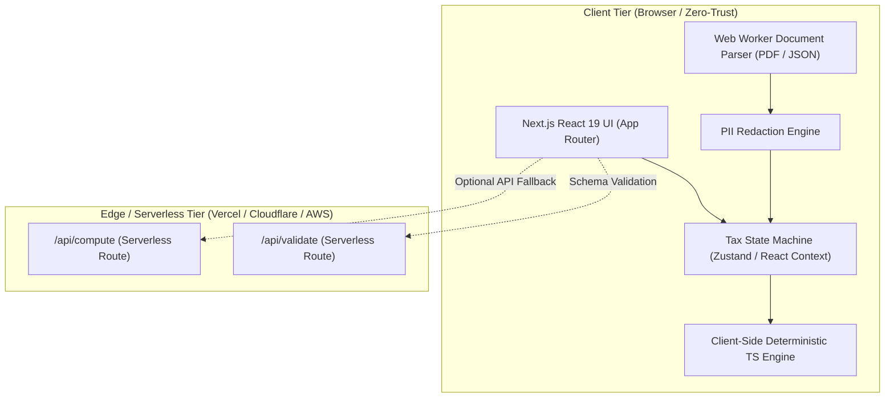

# 4. Serverless Next.js Architecture Specification

> **Enterprise-Grade, 100% Serverless Web Application Architecture**  
> *Framework: Next.js 16 (App Router) · React 19 · TypeScript · Tailwind CSS v4*  
> *Maintained & Owned by Kishan Ojha (`Kishann911/TaxSarthi-`)*

---

## 1. Architectural Philosophy & Deployment Target

The redesigned TaxPilot web application is architected to be **100% serverless, zero-maintenance, and zero-arithmetic-drift**.



### Why Serverless Next.js?
1. **Zero Cold Starts & Zero Server Costs:** Static assets are distributed across global edge CDNs (Vercel / Cloudflare). No always-on servers or idle cloud fees.
2. **Offline Capable & Client-First:** The entire calculation engine runs locally in JavaScript/TypeScript inside the user's browser. It functions with zero latency and requires no network connection once loaded.
3. **Zero Database Dependency:** User tax returns, documents, and financial data are never stored on any server. State lives solely in transient client memory, guaranteeing zero data liability.
4. **Edge API Compatibility:** Provides serverless RESTful endpoints for programmatic tax calculation, enabling other AI agents and external CLI tools to invoke TaxPilot over HTTP.

---

## 2. Directory Structure (`web/` or Next.js Root)

```
web/
├── app/
│   ├── layout.tsx                # Root layout with Geist font, metadata & theme provider
│   ├── page.tsx                  # Master landing page, Hero, and Tax Studio
│   ├── studio/                   # Dedicated fullscreen Tax Studio view
│   ├── sft/                      # Standalone AIS SFT Directory explorer
│   ├── matrix/                   # Deductions & Exemptions Matrix
│   ├── checklist/                # Pre-filing audit checklist
│   ├── wizard/                   # 5-step ITR form selector wizard
│   └── api/
│       ├── compute/route.ts      # Edge function: POST /api/compute (Deterministic tax computation)
│       ├── validate/route.ts     # Edge function: POST /api/validate (Schema & invariant checker)
│       └── redact/route.ts       # Edge function: POST /api/redact (PII scrubber)
│
├── components/
│   ├── layout/
│   │   ├── Navbar.tsx            # Glassmorphic header with navigation & theme switcher
│   │   ├── Footer.tsx            # Statutory disclaimer & open source links
│   │   └── StatusBar.tsx         # Pinned AY 2026-27 status ribbon
│   ├── studio/
│   │   ├── TaxStudio.tsx         # Master studio container orchestrating inputs & results
│   │   ├── StudioInputs.tsx      # Tabbed input console (Salary, Gains, Deductions, Advance Tax)
│   │   ├── RegimeVerdict.tsx     # Real-time winner banner & rupee savings counter
│   │   ├── RegimeLedger.tsx      # Side-by-side New vs Old regime breakdown
│   │   ├── SlabBreakdownTable.tsx# Statutory bracket breakdown table
│   │   └── AdvanceTaxBar.tsx     # Live Section 234A/B/C/F interest diagnostics
│   ├── visualizers/
│   │   ├── BreakEvenRadar.tsx    # Interactive Old vs New regime crossover chart
│   │   └── TaxWaterfall.tsx      # Visual breakdown of tax components
│   ├── parsers/
│   │   ├── DocumentDropzone.tsx  # Drag & drop Form 16 PDF / AIS JSON parser
│   │   └── PrivacySanitizer.tsx  # Client-side PII scrubbing sandbox
│   └── ui/                       # Accessible UI primitives (Button, Input, Tabs, Dialog, Badge)
│
├── lib/
│   ├── engine/                   # The Authoritative TypeScript Statutory Engine
│   │   ├── constants.ts          # Statutory slabs, rebate caps, surcharge tiers for AY 2026-27
│   │   ├── taxEngine.ts          # Pure deterministic tax calculation core
│   │   ├── validator.ts          # Zod runtime schema matching validate_income.py
│   │   ├── interest234.ts        # Section 234A/B/C interest & 234F fees
│   │   ├── surcharge.ts          # Surcharge calculation with marginal relief & 15% cap
│   │   └── formatters.ts         # Indian currency formatting (₹ Lakhs / Crores)
│   ├── parsers/
│   │   ├── pdfWorker.ts          # Form 16 Part B text extractor
│   │   └── aisParser.ts          # AIS JSON schema mapper
│   └── types/
│       └── tax.ts                # TypeScript interfaces for inputs, outputs, and schedules
│
├── public/                       # Static SVGs, logos, and icons
├── tailwind.config.ts            # Fintech design tokens and animations
├── tsconfig.json                 # Strict TypeScript configuration
└── next.config.ts                # Serverless standalone or export configuration
```

---

## 3. The TypeScript Statutory Engine Architecture

To eliminate the 10 critical bugs discovered in the legacy JavaScript code, the TypeScript engine (`lib/engine/taxEngine.ts`) is a direct, mathematical port of `taxsarthi/core/tax_engine.py`:

```typescript
// lib/engine/types.ts
export interface TaxInputs {
  salaryGross?: number;
  exemptAllowances?: number;
  professionalTax?: number;
  hraExemption?: number;
  homeLoan24b?: number;
  freelanceGross?: number;
  presumptiveRate?: number;
  stcg111a?: number;
  ltcg112a?: number;
  ltcgOther?: number;
  stcgSlab?: number;
  vdaCrypto?: number;
  savingsInterest?: number;
  fdInterest?: number;
  dividends?: number;
  ded80c?: number;
  ded80ccd1b?: number;
  ded80ccd2?: number;
  ded80dSelf?: number;
  ded80dParents?: number;
  ded80e?: number;
  ded80g?: number;
  tdsSalary?: number;
  tdsOther?: number;
  advanceTaxPayments?: { date: string; amount: number }[];
  ageCategory?: 'regular' | 'senior' | 'super_senior';
  dueDate?: string;
  filingDate?: string;
}

export interface RegimeResult {
  grossTotalIncome: number;
  deductionsTotal: number;
  totalIncome: number;
  slabIncome: number;
  slabTax: number;
  specialTaxes: number;
  rebate87a: number;
  marginalRelief87a: number;
  surcharge: number;
  surchargeMarginalRelief: number;
  cess: number;
  totalTaxLiability: number;
  prepaidTaxes: number;
  interest234A: number;
  interest234B: number;
  interest234C: number;
  fee234F: number;
  finalPayableOrRefund: number;
  slabBreakdown: SlabTierBreakdown[];
}
```

### Corrections Built into the TypeScript Engine:
1. **Accurate Calendar Month Counting for Section 234B:**
   - Tracks actual months and partial months across calendar year rollovers (e.g. from 31 March 2026 into 2027).
2. **Unexhausted Basic Exemption Absorption:**
   - Evaluates whether slab income is below the basic exemption (₹4L New / ₹2.5L Old) and offsets the remaining exemption against Section 111A / 112A capital gains.
3. **VDA Crypto Surcharge Inclusion:**
   - Ensures VDA gains are subjected to the proper 25% or 37% surcharge tiers above ₹2 Crore.
4. **Strict 15% Surcharge Capping on Dividends & Capital Gains:**
   - Isolates dividend tax and special-rate equity gains so surcharge never exceeds 15%.
5. **Surcharge Marginal Relief:**
   - Employs iterative boundary tests at ₹50L, ₹1Cr, ₹2Cr, and ₹5Cr to eliminate tax cliffs.
6. **Rule 119A Statutory Rounding:**
   - Floors all interest calculation bases to multiples of ₹100.
7. **Senior Citizen Advance Tax Immunity (Section 207(2)):**
   - Automatically sets 234B and 234C interest to ₹0 for senior citizens without business income.
8. **Presumptive 100% Single Installment (Section 234C(1)(b)):**
   - Evaluates only the 15 March deadline for freelance filers u/s 44ADA.

---

## 4. Serverless Edge API Routes

The application exposes Edge runtime endpoints for external integrations:

```typescript
// app/api/compute/route.ts
import { NextRequest, NextResponse } from 'next/server';
import { computeTax } from '@/lib/engine/taxEngine';
import { validateIncomeSchema } from '@/lib/engine/validator';

export const runtime = 'edge';

export async function POST(req: NextRequest) {
  try {
    const body = await req.json();
    const validation = validateIncomeSchema(body);
    if (!validation.valid) {
      return NextResponse.json({ error: "Validation failed", details: validation.errors }, { status: 400 });
    }
    const computation = computeTax(body);
    return NextResponse.json(computation, { status: 200 });
  } catch (err: any) {
    return NextResponse.json({ error: "Computation error", message: err.message }, { status: 500 });
  }
}
```

---

## 5. Deployment Options & Zero-Error Guarantees

The project supports two distinct serverless deployment modes:

1. **Option A: Static HTML Export (`output: 'export'`)**
   - Emits purely static HTML/CSS/JS into `out/`.
   - Hostable on GitHub Pages, Cloudflare Pages, AWS S3/CloudFront, or Netlify with $0 operating cost.
2. **Option B: Vercel / Cloudflare Edge Serverless**
   - Supports both static pages and dynamic Edge API routes (`/api/compute`).
   - Automated global CDN caching and atomic deploys.
